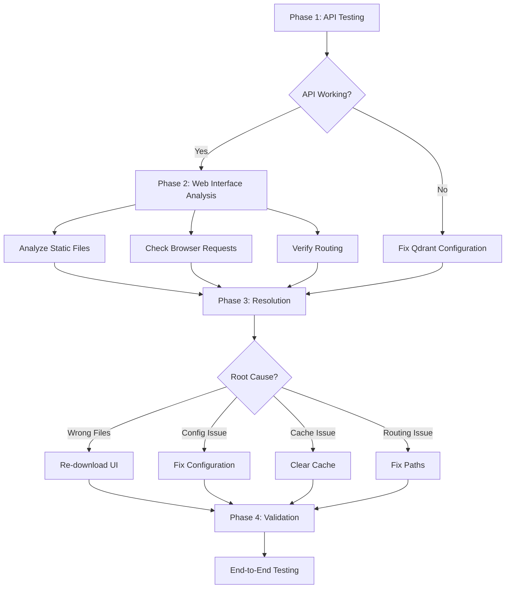

# Qdrant Web Interface Diagnostic & Resolution Plan

**Created:** 2025-01-06 23:09  
**Mode:** Architect  
**Status:** Implementation Ready

## 🎯 **Executive Summary**

**Problem:** Qdrant web interface showing "Open WebUI" login screen instead of native Qdrant dashboard  
**Approach:** API-first validation followed by targeted web interface resolution  
**Expected Outcome:** Fully functional Qdrant installation with both API and web interface working correctly

## 📊 **Current State Analysis**

### ✅ **Working Components:**
- Qdrant server running on port 8080
- Enhanced Makefile with PORT configuration and server management
- Static files downloaded and installed in `./static` directory
- Sync script correctly configured for official Qdrant Web UI

### ❌ **Issues Identified:**
- Web interface displays "Open WebUI" login screen (unexpected)
- Should show native Qdrant dashboard without authentication
- Potential mismatch between expected and actual web interface

### 🔍 **Configuration Details:**
- **Server:** `localhost:8080` (configurable via `PORT` environment variable)
- **Web UI Path:** `/dashboard` (standard Qdrant configuration)
- **Authentication:** Disabled (no API keys configured)
- **CORS:** Enabled for web access

## 🚀 **Implementation Plan**



### **Phase 1: Core API Validation** 🔧

**Objective:** Establish baseline Qdrant functionality before addressing web interface

#### **1.1 Health Check**
```bash
# Basic server health
curl -X GET http://localhost:8080/health
# Expected: {"status": "ok"} or similar

# Server info
curl -X GET http://localhost:8080/
# Expected: JSON with version info
```

#### **1.2 Collections Management**
```bash
# List collections (should be empty initially)
curl -X GET http://localhost:8080/collections

# Create test collection
curl -X PUT http://localhost:8080/collections/test_collection \
  -H "Content-Type: application/json" \
  -d '{
    "vectors": {
      "size": 4,
      "distance": "Cosine"
    }
  }'

# Verify collection creation
curl -X GET http://localhost:8080/collections/test_collection
```

#### **1.3 Vector Operations**
```bash
# Insert test vector
curl -X PUT http://localhost:8080/collections/test_collection/points \
  -H "Content-Type: application/json" \
  -d '{
    "points": [
      {
        "id": 1,
        "vector": [0.1, 0.2, 0.3, 0.4],
        "payload": {"test": "data"}
      }
    ]
  }'

# Search vectors
curl -X POST http://localhost:8080/collections/test_collection/points/search \
  -H "Content-Type: application/json" \
  -d '{
    "vector": [0.1, 0.2, 0.3, 0.4],
    "limit": 5
  }'
```

**Success Criteria:**
- [ ] Health endpoint responds with success
- [ ] Collections can be created and retrieved
- [ ] Vector operations work correctly
- [ ] No authentication errors

### **Phase 2: Web Interface Analysis** 🔍

**Objective:** Identify specific web interface issues

#### **2.1 Static File Verification**
```bash
# Check what's actually served at dashboard
curl -I http://localhost:8080/dashboard/

# Download index.html to examine
curl http://localhost:8080/dashboard/index.html

# Check asset loading
curl -I http://localhost:8080/dashboard/assets/index-BYyWHt5V.js
```

#### **2.2 Browser Network Analysis**
- Open Developer Tools in browser
- Navigate to `http://localhost:8080/dashboard`
- Check Network tab for failed requests
- Examine Console for JavaScript errors
- Verify asset loading paths

#### **2.3 File System Validation**
```bash
# Verify static directory contents
ls -la ./static/

# Check for correct Qdrant UI files
grep -r "qdrant" ./static/ || echo "No Qdrant references found"
grep -r "Open WebUI" ./static/ || echo "No Open WebUI references found"

# Verify manifest.json content
cat ./static/manifest.json
```

**Analysis Points:**
- [ ] Static files serve correctly
- [ ] No 404 errors for assets
- [ ] JavaScript loads and executes
- [ ] Correct Qdrant UI files present

### **Phase 3: Targeted Resolution** 🛠️

**Based on Phase 1 & 2 results:**

#### **Option A: API Issues Found**
```bash
# Check Qdrant configuration
cat config/config.yaml | grep -A5 -B5 "service:"

# Restart with fresh configuration
make kill
make run PORT=8080

# Verify configuration changes
curl http://localhost:8080/health
```

#### **Option B: Wrong Web Interface Files**
```bash
# Re-download official Qdrant Web UI
./tools/sync-web-ui.sh

# Verify download
ls -la ./static/
cat ./static/manifest.json

# Restart server to pick up new files
make kill
make run PORT=8080
```

#### **Option C: Cache/Browser Issues**
```bash
# Clear server-side cache
rm -rf ./storage/snapshots_temp/

# Restart server
make kill
make run PORT=8080

# Clear browser cache (manual step)
# - Hard refresh (Ctrl+Shift+R)
# - Clear browser data
# - Incognito mode test
```

#### **Option D: Configuration Issues**
```bash
# Check static file serving path
grep -r "dashboard" src/ || echo "No dashboard path found"

# Verify CORS configuration
curl -H "Origin: http://localhost:8080" \
     -H "Access-Control-Request-Method: GET" \
     -H "Access-Control-Request-Headers: X-Requested-With" \
     -X OPTIONS http://localhost:8080/
```

### **Phase 4: End-to-End Validation** ✅

**Objective:** Confirm complete functionality

#### **4.1 Web Interface Testing**
- [ ] Dashboard loads without login prompt
- [ ] Collections tab accessible
- [ ] Vector operations available through UI
- [ ] No JavaScript errors in console

#### **4.2 Functionality Verification**
```bash
# Create collection via API
curl -X PUT http://localhost:8080/collections/ui_test \
  -H "Content-Type: application/json" \
  -d '{"vectors": {"size": 3, "distance": "Cosine"}}'

# Verify it appears in web UI
# Manual: Check dashboard for new collection

# Test vector operations via web interface
# Manual: Add vectors through UI, perform search
```

#### **4.3 Performance Validation**
```bash
# Test API response times
time curl http://localhost:8080/collections

# Check server logs for errors
# Monitor terminal output during testing
```

## 📋 **Success Criteria**

### **Technical Requirements:**
1. ✅ All API endpoints respond correctly
2. ✅ Collections can be created/managed via API
3. ✅ Vector operations function properly
4. ✅ Web interface loads without authentication
5. ✅ Full CRUD operations available through web UI
6. ✅ No browser console errors
7. ✅ Responsive design works correctly

### **User Experience:**
1. ✅ Direct access to `http://localhost:8080/dashboard`
2. ✅ Intuitive collection management interface
3. ✅ Vector search functionality through web UI
4. ✅ Real-time updates and feedback
5. ✅ Proper error handling and messaging

## 🔧 **Troubleshooting Guide**

### **Common Issues & Solutions:**

| Issue | Symptoms | Solution |
|-------|----------|----------|
| API Not Responding | Connection refused, timeouts | Check server status, restart Qdrant |
| 404 Errors | Web assets not loading | Re-run sync script, verify static files |
| Authentication Prompts | Login screen appears | Verify config has no API keys set |
| JavaScript Errors | Broken UI functionality | Clear cache, check browser compatibility |
| Wrong Interface | Non-Qdrant UI appears | Re-download official UI files |
| CORS Issues | API calls blocked | Verify CORS enabled in config |

### **Diagnostic Commands:**
```bash
# Server status
ps aux | grep qdrant

# Port verification
netstat -tlnp | grep 8080

# Log monitoring
tail -f /path/to/qdrant/logs  # if logging to file

# Configuration check
make run PORT=8080 --dry-run  # if make supports it
```

## 📝 **Implementation Notes**

### **Prerequisites:**
- Qdrant server compiled and ready (`./target/release/qdrant`)
- Port 8080 available (or alternative configured)
- `curl` available for API testing
- Modern web browser for UI testing

### **Environment:**
- **OS:** macOS Sequoia
- **Shell:** /opt/homebrew/bin/bash
- **Working Directory:** /Users/rich/ws/git/src/sys/qdrant
- **Current Status:** Server running on port 8080

### **Documentation:**
- All commands tested in current environment
- Results will be documented in memory bank
- Final configuration captured for reproducibility

## 🎯 **Next Steps**

1. **Execute Phase 1:** API endpoint testing and validation
2. **Execute Phase 2:** Web interface analysis and diagnosis
3. **Execute Phase 3:** Implement targeted resolution based on findings
4. **Execute Phase 4:** Comprehensive end-to-end testing and validation
5. **Document Results:** Update memory bank with final configuration

**Estimated Timeline:** 30-45 minutes for complete diagnostic and resolution

---

*This plan will be executed systematically, with results documented at each phase to ensure complete resolution of the web interface issues.*